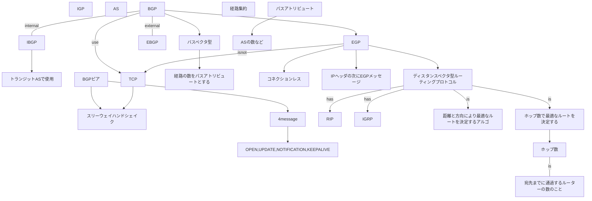

## BGP をRUSTでやる

## BGPメモ
- 2022/12/12-

```mermaid
flowchart TD;
    IGP;
    AS;
    BGP-->EGP;
    BGP--internal---IBGP-->トランジットASで使用
    BGP--external---EBGP
    BGPピア-->スリーウェイハンドシェイク;
    BGPピア-->4message-->OPEN,UPDATE,NOTIFICATION,KEEPALIVE
    BGP--use-->TCP;
    TCP-->スリーウェイハンドシェイク
    経路集約
    BGP-->バスベクタ型-->経路の数をパスアトリビュートとする
    パスアトリビュート-->ASの数など
    EGP-->コネクションレス;
    EGP--isnot-->TCP;
    EGP-->IPヘッダの次にEGPメッセージ;
    EGP-->ディスタンスベクタ型ルーティングプロトコル;
    ディスタンスベクタ型ルーティングプロトコル--has-->RIP
    ディスタンスベクタ型ルーティングプロトコル--has-->IGRP
    ディスタンスベクタ型ルーティングプロトコル--is-->距離と方向により最適なルートを決定するアルゴ
    ディスタンスベクタ型ルーティングプロトコル--is-->ホップ数で最適なルートを決定する
    ホップ数で最適なルートを決定する-->ホップ数
    ホップ数--is---宛先までに通過するルーターの数のこと
```

