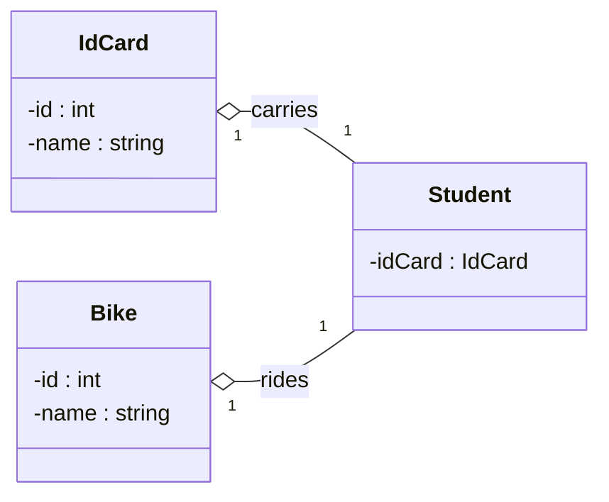

Git hub actions と next.js のテンプレートで作成した　[こちら](https://github.com/tetsu-sh/my-blog)を参考に

## markdown でかける

## todo

- 目次を作る

- seo
- tag
- content 見やすくする

## やったこと

- zenn css https://zenn.dev/team_zenn/articles/intro-zenn-markdown
  - mermaid
- pages のヒエラルキー
- about page
- domain
- mokuji sticky

## できること

- 写真の埋め込みはこれ
  
- twitter 埋め込み

https://twitter.com/tetsu04228/status/1586266431167299585?s=20&t=DF_NArjUoggpu4nvYnq-OA

- message
  :::message
  nya-n

- youtube

https://www.youtube.com/watch?v=b9aoMzdPzy8

- mermaid

